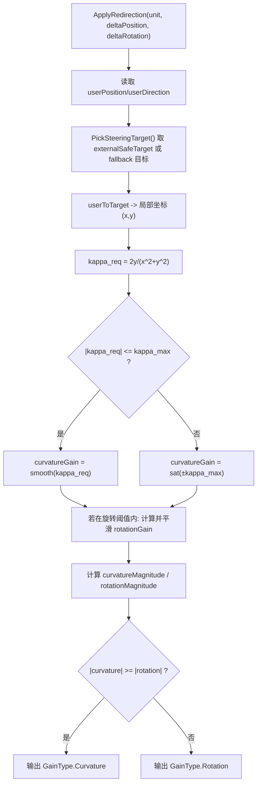

# LocalSafeCurvatureRedirector 设计与流程说明

## 1. 背景与目标
`LocalSafeCurvatureRedirector` 的目标是：
- 以 `LocalSafeTargetSelector` 每帧给出的局部安全目标点为输入；
- 用几何曲率公式直接计算曲率增益（curvature gain）；
- 在“虚拟用户正在旋转”时再计算 rotation gain；
- translation gain 保持稳定，不引入额外平移增益扰动。

该控制器按项目既有调用链运行，不改主循环：
`RedirectedUnit.Move -> redirector.ApplyRedirection(...)`

## 2. 类关系与职责
### 2.1 `SteerToTargetRedirector : GainRedirector`
- 这是“通用 steer-to-target 基类”。
- 提供重定向器基础字段（`translationGain/rotationGain/curvatureGain`）和统一入口 `ApplyRedirection(...)`。

### 2.2 `LocalSafeCurvatureRedirector : SteerToTargetRedirector`
- 这是“本次策略实现类”，复用基类接入方式，但覆盖策略细节。
- 关键能力：
  - `SetExternalSafeTarget(Vector2)`：接收 `GlobalCoordinationManager` 注入的本帧目标点。
  - `ClearExternalSafeTarget()`：目标无效时清空，避免继续使用旧目标。
  - `ApplyRedirection(...)`：执行曲率/旋转增益计算与最终重定向类型选择。

## 3. 管理器接入点
## 3.1 `UnitSetting.GetRedirector()`
文件：`Assets/RDW/02 Script/RDW_Scripts/Setting/UnitSetting.cs`
- 在 `RedirectType` 增加：`LocalSafeCurvature`
- 在 `switch (redirectType)` 增加：
```csharp
case RedirectType.LocalSafeCurvature:
    redirector = new LocalSafeCurvatureRedirector();
    break;
```

这一步保证控制器被实例化，并进入既有 `RedirectedUnit.Move` 调用链。

## 3.2 `GlobalCoordinationManager.ApplyLocalTargetsToRedirectors()`
文件：`Assets/RDW/02 Script/GlobalCoordination/GlobalCoordinationManager.cs`
- 当 `redirector is LocalSafeCurvatureRedirector`：
  - `targetResult.HasValidTarget == true`：调用 `SetExternalSafeTarget(...)`
  - `targetResult.HasValidTarget == false`：调用 `ClearExternalSafeTarget()`

这一步保证“每帧新目标注入”和“无效目标清空”。

## 4. 控制思想（核心）
以用户局部坐标系中的目标点 `(x, y)` 为核心，按几何曲率驱动：

1. 目标点转局部坐标  
`x = dot(userToTarget, forward)`  
`y = dot(userToTarget, left)`

2. 计算所需曲率  
`kappa_req = 2y / (x^2 + y^2)`

3. 可达性判断与约束  
- 若 `|kappa_req| <= kappa_max`：使用平滑后的 `kappa_req`
- 若 `|kappa_req| > kappa_max`：直接饱和到 `sign(kappa_req) * kappa_max`

4. rotation gain 仅在虚拟旋转时更新  
- 判定：`abs(deltaRotation) >= ROTATION_THRESHOLD`
- 按“目标角差 + 当前旋转方向”映射到 `[MIN_ROTATION_GAIN, MAX_ROTATION_GAIN]`
- 再做时间平滑

5. translation gain 保持稳定  
- 固定值，不参与动态调制

6. 本帧重定向输出选择  
- 分别计算本帧 `curvatureMagnitude` 和 `rotationMagnitude`
- 取绝对值更大的类型作为本帧输出（保持与现有工程行为一致）

## 5. 每帧流程图


## 6. 关键参数建议
- `kappa_max`：建议先与 `HODGSON_MAX_CURVATURE_GAIN` 保持一致，便于与旧控制器对比。
- `CURVATURE_SMOOTHING_FACTOR`：过小会慢响应，过大易抖动。
- `ROTATION_THRESHOLD`：过低会导致静止抖动时也频繁调整 rotation gain。
- `FALLBACK_TARGET_DISTANCE`：仅在没拿到外部目标时生效，建议取中等值保证方向稳定。

## 7. 调试建议
- 先固定 `redirectType = LocalSafeCurvature` 做单用户验证，再扩大到多用户。
- 重点看三条日志曲线：`target valid`、`curvatureGain`、`rotationGain`。
- 若出现转向反号问题，优先检查局部 `left` 方向定义和 `GainType.Curvature` 输出符号约定是否一致。
